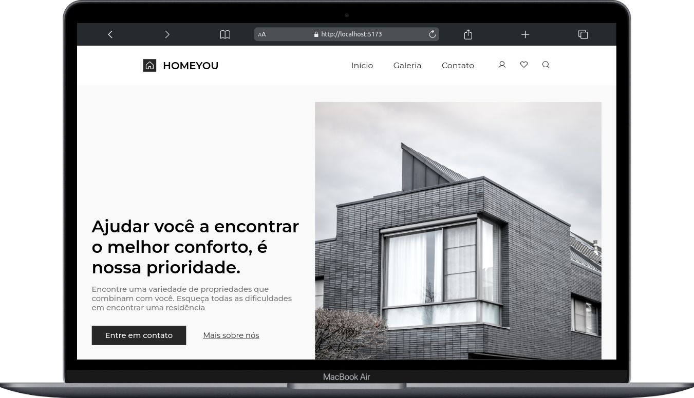
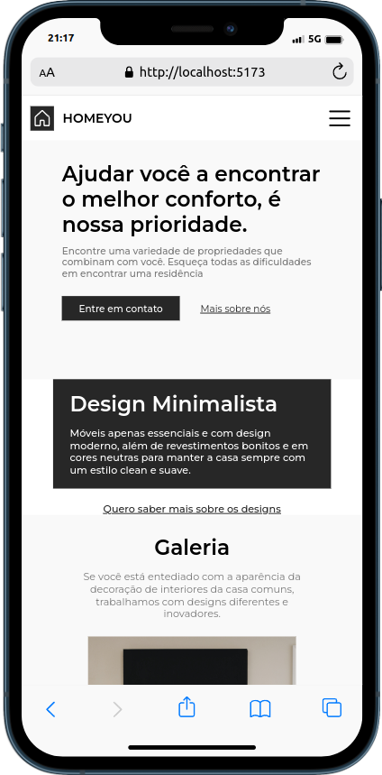

# 🏠 React-Homeyou EN
## https://react-homeyou.vercel.app/

This is a project built using React as the library for building the user interface and Vite as the development and build tool. The design was created by Iuri Silva.

The project was created as part of the Codelândia project, created by Yuri Silva. It consists of a fictional web page for a home services company called Homeyou.

  

    
<b>🖥️ Desktop</b>

    
  

  

    
<b>📱 Mobile</b>

    
  

## Instalação 🚀

To run this project locally, you will need to have [Node.js](https://nodejs.org/en/) installed on your computer. 

1. Clone this repository on your machine:

        git clone https://github.com/SrFreitass/react-homeyou

2. Navigate to the root directory of the project:

        cd homeyou

3. Install the project dependencies:

        npm install

## Rodando o projeto 🏃‍♀️

-  After following the installation steps, you can run the project with the following command:

        npm run dev

This command will start the Vite development server and open the project web page in your default browser.

## Building for production 🔨

To build an optimized version of the project for production, you can run the following command:

This command will build an optimized version of the project in the `dist` folder, ready to be hosted on a web server.

I accept constructive feedback, feel free to send me suggestions and improvements. 🙌

⠀⠀⠀⠀⠀

# 🏠 React-Homeyou PT-BR

Este é um projeto feito utilizando [React](https://reactjs.org/) como biblioteca para a construção da interface do usuário e [Vite](https://vitejs.dev/) como ferramenta de construção e desenvolvimento. O design foi criado pelo Iuri silva.

O projeto foi criado como parte do projeto Codelândia, criado por Yuri Silva. Ele consiste em uma página web fictícia para uma empresa de serviços para casas chamada Homeyou.

## Instalação 🚀

Para rodar este projeto localmente, você precisará ter o [Node.js](https://nodejs.org/en/) instalado em seu computador.

1. Clone este repositório em sua máquina:

        git clone https://github.com/SrFreitass/react-homeyou

2. Navegue até o diretório raiz do projeto:

        cd homeyou

3. Instale as dependências do projeto:

        npm install

## Rodando o projeto 🏃‍♀️

-  Após seguir os passos de instalação, você pode rodar o projeto com o seguinte comando:

        npm run dev

Este comando iniciará o servidor de desenvolvimento do Vite e abrirá a página web do projeto em seu navegador padrão.

## Construindo para produção 🔨

Para construir uma versão otimizada do projeto para produção, você pode rodar o seguinte comando:

Este comando construirá uma versão otimizada do projeto na pasta `dist`, pronta para ser hospedada em um servidor web.

Aceito feedbacks construtivos, fique à vontade para me enviar sugestões e melhorias. 🙌

